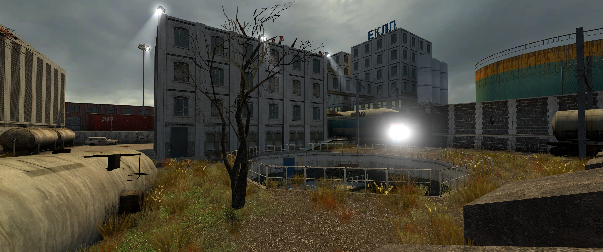
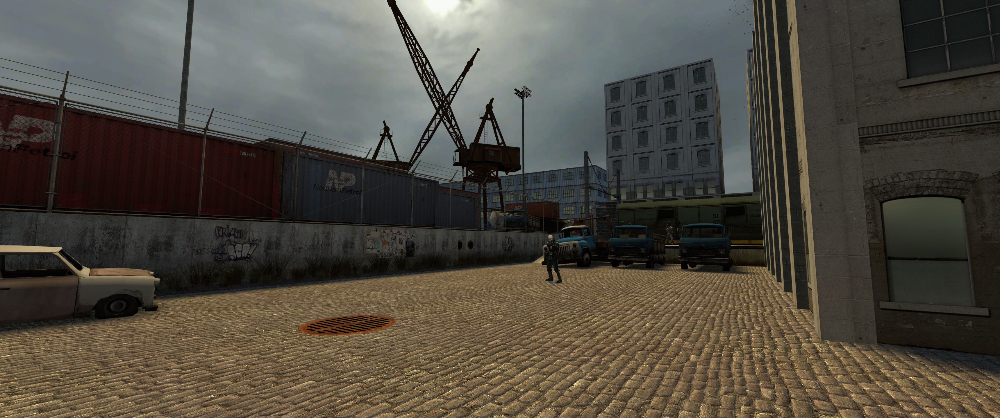
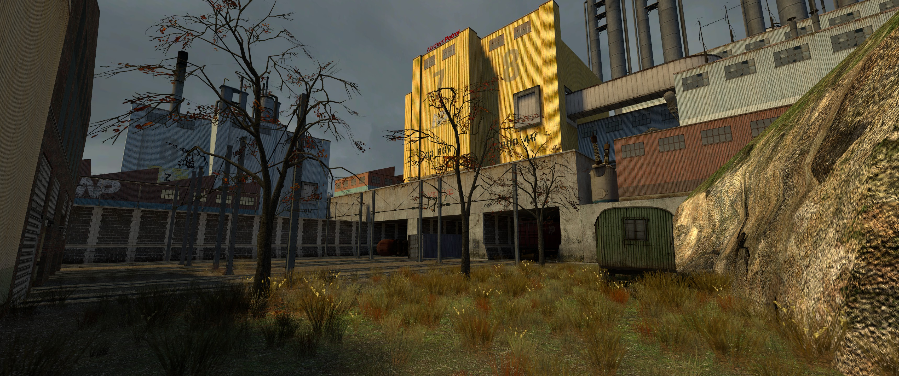
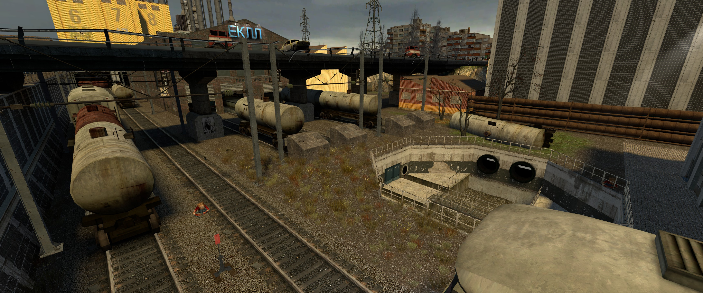
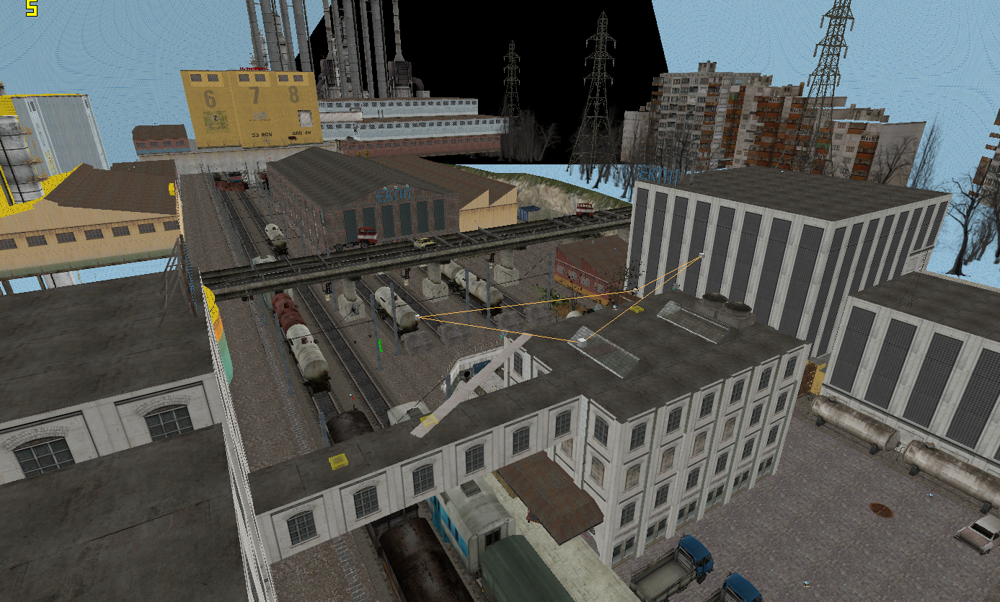

Train yard is Half-Life 2 single player map

Created 2006-09-06

To launch in the Hammer editor:

- Install the Source SDK Base 2013 single player from Steam "Tools" section
- Install Source SDK from Steam "Tools" section
- Run hammer via the hammer.exe in `steamapps\common\Half-Life 2\bin\hammer.exe`

Running the map:

- Open in Hammer and click the "Run Map!" icon 

# Screenshot:

# Overview:

